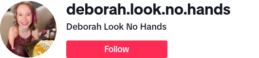

# TikTok Detection (VERY BETA)

### TikTok Profile Change Detection

Tired of missing updates from your favorite TikTok creators but hesitant to install the app. This tool is designed to keep you in the loop by detecting changes in TikTok profiles and profile pictures.

For instance, by running this application for a user like https://www.tiktok.com/@deborah.look.no.hands, you'll receive alerts whenever her profile or profile image changes.




## Versions
There are two versions of this application available:
- **Windows Version:** You can download the code and run it on a Windows machine. Please note that the Apprise integration is not supported on Windows.
- **Linux Version:** If you prefer Linux, fear not! A Docker image has been prepared for your convenience.

## Docker
- **Image:** https://hub.docker.com/r/xavierh/tiktok_detection
- **Command:** docker pull xavierh/tiktok_detection:latest
- **Supported OS/ARCH:** Linux/amd64

## Github Repo
For the latest updates and to contribute, check out https://github.com/xavier-hernandez/tiktok_detection


## Technology used
This project utilizes the following technologies:

- Visual Studio 2022
- Emgu.CV
- Microsoft.ML
- PuppeteerSharp

## Configuration

To configure the tool, follow these steps:

1. Create a file named `settings.json` under your assets folder.
2. Populate the JSON file with the following sections:

```
{
  "apprise": [
    "mailto://sandbox.smtp.mailtrap.io:2525?user=test&pass=test"
  ],
  "tiktok": [
    "https://www.tiktok.com/@deborah.look.no.hands"
  ],
  "timeout": 5,
  "similarityTrigger": 90
}
```

- **Apprise**: Specify notification configurations for each TikTok URL. Refer to [Apprise](https://github.com/caronc/apprise) for available services.
- **TikTok**: Add the URLs of the TikTok profiles you want to monitor.
- **Timeout**: Set the time interval in minutes to check the URLs again.
- **Similarity Trigger**: Define the percentage threshold for triggering alerts based on screenshot differences.

### Docker Compose

If you're using Docker Compose, include the following service definition in your `docker-compose.yml` file:

```yml
services:
    tiktok_detection:
        image: 'xavierh/tiktok_detection'
        container_name: tiktok_detection
        restart: always
        volumes:
        - /path/to/assets:/assets
```